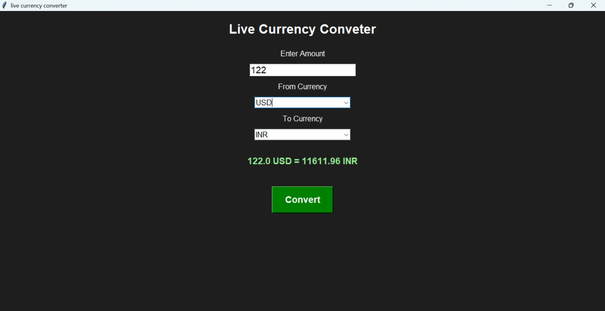

# 💱 Live Currency Converter

## Screenshot



A Python Tkinter-based GUI application that converts currencies using real-time exchange rates. Users can enter an amount, select source and target currencies, and instantly get the converted value through a clean and user-friendly interface.

## 🚀 Features
- Real-time currency conversion
- Simple and attractive GUI
- Supports multiple currencies
- Fast and accurate exchange rates
- Error handling for invalid inputs

## 🛠️ Technologies Used
- Python
- Tkinter
- Requests
- Exchange Rate API

## 📦 Installation
```bash
pip install requests
python currency_converter_app.py
```

## 🎯 How to Use
1. Enter the amount.
2. Select the source currency.
3. Select the target currency.
4. Click the Convert button.
5. View the converted amount instantly.

## 📚 What I Learned
- Python GUI development with Tkinter
- API integration
- Working with JSON data
- Error handling
- Building real-world projects

## 👨‍💻 Author
Subrat Dubey
